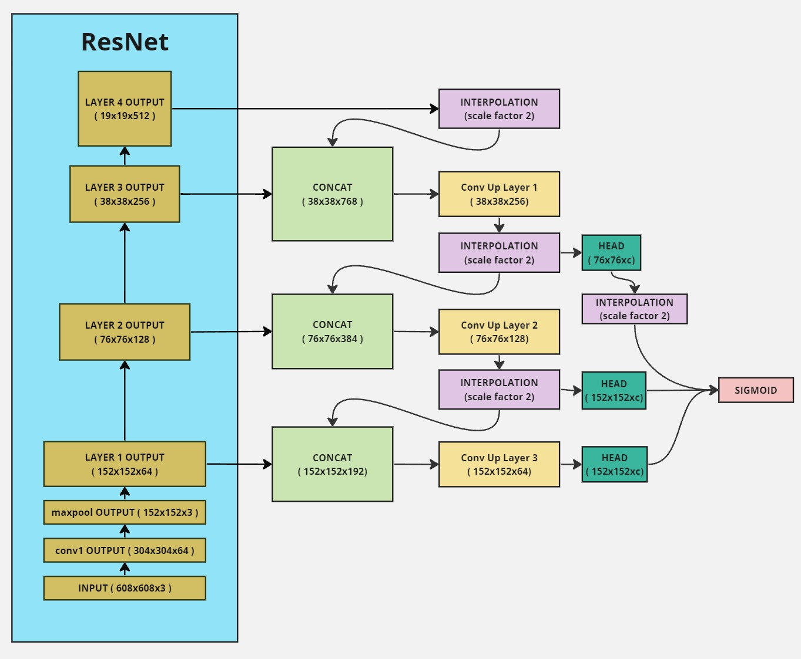
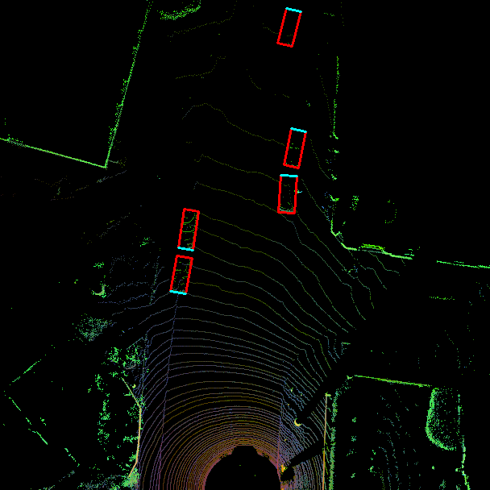
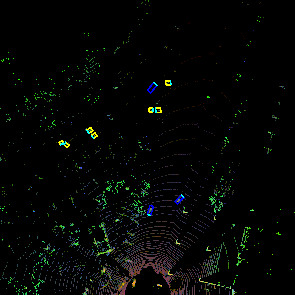
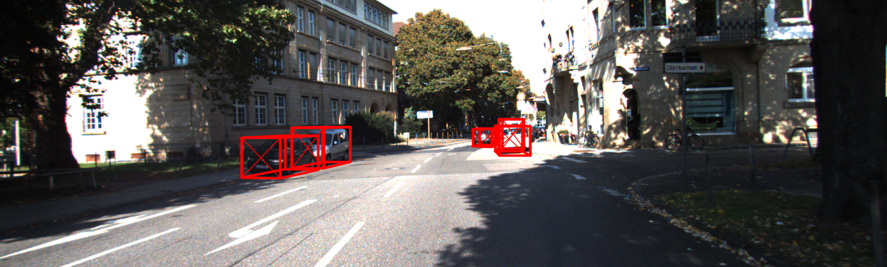
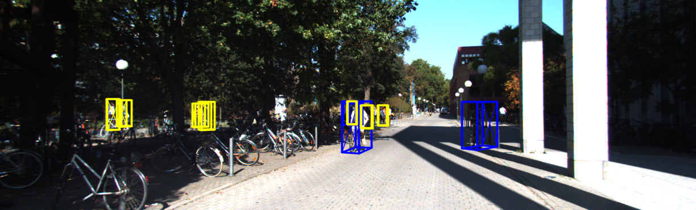
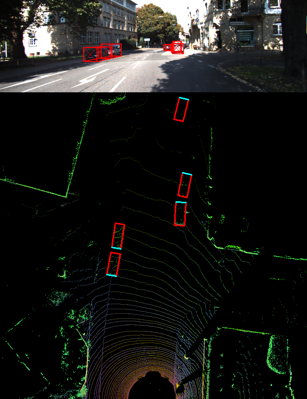
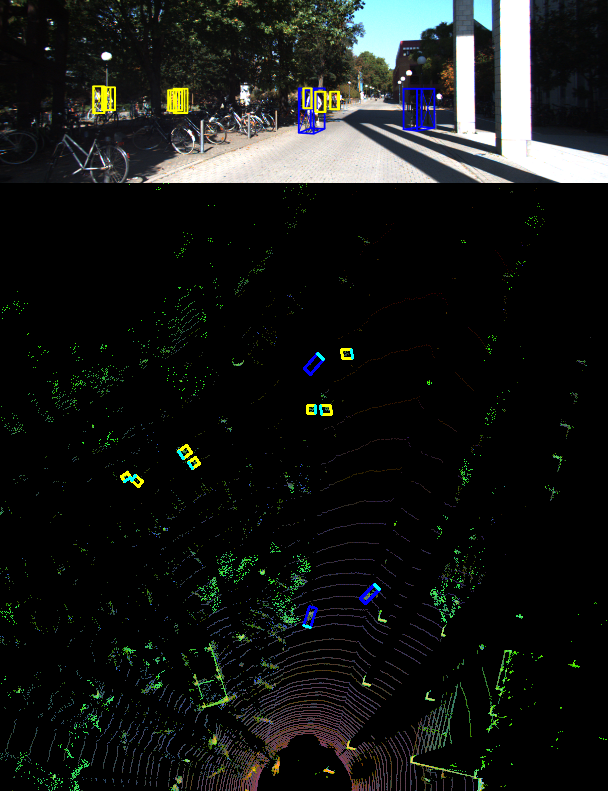

## Introduction
---

In the rapidly evolving landscape of autonomous vehicles and robotics, the demand for robust and efficient 3D object detection algorithms is more pronounced than ever. The ability to accurately perceive and interpret the surrounding environment is crucial for the safe navigation and decision-making processes of autonomous systems. In this context, the SFA3D (Super Fast and Accurate 3D object detection using LiDAR data) algorithm offers a powerful and efficient approach to 3D object detection using LiDAR data.

Traditional computer vision algorithms have primarily focused on 2D object detection, providing valuable insights into the spatial arrangement of objects in images. However, the transition to autonomous vehicles and robotics necessitates a paradigm shift towards 3D perception. By incorporating depth information from LiDAR sensors, 3D object detection enhances the ability to discern the spatial layout of objects, leading to more informed decision-making and safer navigation.

SFA3D stands out as a formidable algorithm designed to address the challenges inherent in 3D object detection using LiDAR data. It leverages a keypoint FPN (Feature Pyramid Network) ResNet architecture, combining the strengths of feature pyramids and keypoint detection for accurate localization and classification of objects in 3D space. The algorithm is not only super fast, enabling real-time applications, but also maintains high accuracy, making it a compelling choice for various autonomous systems.

The primary goal of this blog post is to provide a comprehensive understanding of the SFA3D algorithm, starting with the foundational step of creating a PyTorch dataloader for the KITTI LiDAR dataset. Through step-by-step guidance, readers will gain insights into the preprocessing techniques required for generating a bird's eye view (BEV) representation, featuring normalized intensity, height, and density channels. Subsequently, the blog will delve into the intricacies of the keypoint FPN ResNet network, explaining how it processes the BEV input and generates heatmaps for each class.

By the end of this exploration, readers will not only have a practical guide for implementing the SFA3D algorithm but also a deeper appreciation for the significance of 3D object detection in advancing the capabilities of autonomous systems. The subsequent sections will further detail the KITTI LiDAR dataset, the algorithm's training process, evaluation metrics, and insightful results, providing a holistic view of the entire workflow. The code is available in the following [link](https://github.com/Ric1779/SFA3D-from-scratch).

## KITTI LiDAR Dataset
---
The KITTI (Karlsruhe Institute of Technology and Toyota Technological Institute) dataset stands as a cornerstone in the field of autonomous driving research, providing a comprehensive set of sensor data for algorithm development and evaluation. Specifically, the KITTI LiDAR dataset comprises a wealth of point cloud data collected using Velodyne HDL-64E LiDAR sensors mounted on a vehicle.

#### KITTI LiDAR Data and Its Importance

The LiDAR data within the KITTI dataset captures the 3D structure of the environment with a high level of detail. Each point in the point cloud represents a reflection from a surface in the surroundings. This data is crucial for tasks like 3D object detection, where precise spatial information is required to accurately localize and classify objects.

The LiDAR data is typically stored in binary files, with each file corresponding to a sequence of frames captured during a driving scenario. Each frame contains a large number of points, with associated attributes such as x, y, and z coordinates, as well as intensity values. Understanding the structure of this data is essential for developing effective algorithms for 3D object detection.

#### Files Involved in the Dataset

The KITTI LiDAR dataset comprises several key files, each serving a specific purpose in the development and evaluation of algorithms:

- **Point Cloud Data (bin files):** These binary files contain the raw LiDAR point cloud data. Each point is represented by its x, y, and z coordinates, and additional information such as reflectance.

- **Calibration Files (calib files):** Calibration is essential for transforming points from the LiDAR sensor's coordinate system to the camera's coordinate system. Calibration files provide intrinsic and extrinsic parameters for this transformation.

- **Annotations (label files):** These files contain annotations for each frame, specifying the 3D bounding boxes of objects in the scene. Each bounding box includes information such as the object's class (car, pedestrian, cyclist), dimensions, location, and orientation.

Understanding the structure and content of these files is crucial for building a PyTorch dataloader, as it forms the foundation for training and evaluating the SFA3D algorithm. [<span style="color: #ffa700;">KITTI Dataset : Files and Format</span>]() provides an extensive explanation regarding the KITTI files used in this project. Download the 3D KITTI detection dataset from [here](http://www.cvlibs.net/datasets/kitti/eval_object.php?obj_benchmark=3d). After downloading the files, place them according to the file structure provided.

```
${ROOT}
└── checkpoints/
    ├── fpn_resnet_18/    
        ├── fpn_resnet_18_epoch_300.pth
└── dataset/    
    └── kitti/
        ├──ImageSets/
        │   ├── test.txt
        │   ├── train.txt
        │   └── val.txt
        ├── training/
        │   ├── image_2/ (left color camera)
        │   ├── calib/
        │   ├── label_2/
        │   └── velodyne/
        └── testing/  
        │   ├── image_2/ (left color camera)
        │   ├── calib/
        │   └── velodyne/
        └── classes_names.txt
└── sfa/
    ├── config/
    │   ├── train_config.py
    │   └── kitti_config.py
    ├── data_process/
    │   ├── kitti_dataloader.py
    │   ├── kitti_dataset.py
    │   └── kitti_data_utils.py
    ├── models/
    │   ├── fpn_resnet.py
    │   ├── resnet.py
    │   └── model_utils.py
    └── utils/
    │   ├── demo_utils.py
    │   ├── evaluation_utils.py
    │   ├── logger.py
    │   ├── misc.py
    │   ├── torch_utils.py
    │   ├── train_utils.py
    │   └── visualization_utils.py
    ├── demo_2_sides.py
    ├── demo_front.py
    ├── test.py
    └── train.py
├── README.md 
└── requirements.txt
```

## Creating a PyTorch Dataloader for KITTI
---
In this section, we will discuss the implementation of a PyTorch DataLoader tailored for the KITTI LiDAR dataset, designed to efficiently load, preprocess, and provide data samples for training, validation, and testing phases. The DataLoader is implemented using the `KittiDataset` class, which encapsulates the necessary functionality for handling LiDAR data, images, and labels. We don't really need the rgb image, but we use to visualize the output. The configs dictionary is generated in `parse_train_configs` method in  `utils\train_utils.py` file, in this file you could set the custom values for dataloaders and training.

#### Initialization and Configuration

The `KittiDataset` class is set up with key configurations including the dataset directory, input size, heatmap size, number of classes, and maximum objects per sample. Also, it includes parameters such as mode (train, val, test), LiDAR data augmentation functions, and probability of horizontal flipping. In our project, the input size is (608x608x3), which corresponds to a front area of a car measuring 50x50 meters. The output size is (152x152xc), where the value of c varies depending on the specific target being addressed.

```python
class KittiDataset(Dataset):
    def __init__(self, configs, mode='train', lidar_aug=None, hflip_prob=None, num_samples=None):
        # Initialize dataset parameters
        self.dataset_dir = configs.dataset_dir
        self.input_size = configs.input_size
        self.hm_size = configs.hm_size
        self.num_classes = configs.num_classes
        self.max_objects = configs.max_objects
        
        # Set mode and sub-folder
        assert mode in ['train', 'val', 'test'], 'Invalid mode: {}'.format(mode)
        self.mode = mode
        self.is_test = (self.mode == 'test')
        sub_folder = 'testing' if self.is_test else 'training'

        # Set data augmentation parameters
        self.lidar_aug = lidar_aug
        self.hflip_prob = hflip_prob

        # Set dataset directories
        self.image_dir = os.path.join(self.dataset_dir, sub_folder, "image_2")
        self.lidar_dir = os.path.join(self.dataset_dir, sub_folder, "velodyne")
        self.calib_dir = os.path.join(self.dataset_dir, sub_folder, "calib")
        self.label_dir = os.path.join(self.dataset_dir, sub_folder, "label_2")
        
        # Read sample IDs from split file
        split_txt_path = os.path.join(self.dataset_dir, 'ImageSets', '{}.txt'.format(mode))
        self.sample_id_list = [int(x.strip()) for x in open(split_txt_path).readlines()]

        # Limit number of samples if specified
        if num_samples is not None:
            self.sample_id_list = self.sample_id_list[:num_samples]
        self.num_samples = len(self.sample_id_list)

    def __getitem__(self, index):
        if self.is_test:
            return self.load_img_only(index)
        else:
            return self.load_img_with_targets(index)
```

#### Data Loading Functions

The `KittiDataset` class provides two main functions for loading data samples: `load_img_only` for the testing phase and `load_img_with_targets` for training and validation phases. These functions load LiDAR data, images, and corresponding labels from the dataset directory. `get_filtered_lidar` filters only the point cloud data within the specified boundary in *cnf.boundary*. `makeBEVMap` is used to convert raw LiDAR data into Bird's eye view 2D image with three channels explained in further sections. `build_targets` is used to create the required output ground truth, discussed in further sections.

```python
    def load_img_only(self, index):
        """Load only image for the testing phase"""
        # Load image and LiDAR data
        sample_id = int(self.sample_id_list[index])
        img_path, img_rgb = self.get_image(sample_id)
        lidarData = self.get_lidar(sample_id)
        lidarData = get_filtered_lidar(lidarData, cnf.boundary)
        
        # Generate bird's eye view (BEV) map from LiDAR data
        bev_map = makeBEVMap(lidarData, cnf.boundary)
        bev_map = torch.from_numpy(bev_map)

        # Metadata for the sample
        metadatas = {
            'img_path': img_path,
        }

        return metadatas, bev_map, img_rgb

    def load_img_with_targets(self, index):
        """Load images and targets for the training and validation phase"""
        # Load image, LiDAR data, and labels
        sample_id = int(self.sample_id_list[index])
        img_path = os.path.join(self.image_dir, '{:06d}.png'.format(sample_id))
        lidarData = self.get_lidar(sample_id)
        calib = self.get_calib(sample_id)
        labels, has_labels = self.get_label(sample_id)
        
        # Apply camera-to-lidar transformation to labels if available
        if has_labels:
            labels[:, 1:] = transformation.camera_to_lidar_box(labels[:, 1:], calib.V2C, calib.R0, calib.P2)

        # Apply data augmentation to LiDAR data and labels
        if self.lidar_aug:
            lidarData, labels[:, 1:] = self.lidar_aug(lidarData, labels[:, 1:])
        
        # Filter LiDAR data and labels
        lidarData, labels = get_filtered_lidar(lidarData, cnf.boundary, labels)

        # Generate bird's eye view (BEV) map from LiDAR data
        bev_map = makeBEVMap(lidarData, cnf.boundary)
        bev_map = torch.from_numpy(bev_map)

        # Apply horizontal flipping with specified probability
        hflipped = False
        if np.random.random() < self.hflip_prob:
            hflipped = True
            bev_map = torch.flip(bev_map, [-1])

        # Build targets for the sample
        targets = self.build_targets(labels, hflipped)

        # Metadata for the sample
        metadatas = {
            'img_path': img_path,
            'hflipped': hflipped
        }

        return metadatas, bev_map, targets
```

#### Auxiliary Functions

Additional helper functions are provided to load images, calibration files, LiDAR data, and labels from their respective directories. These functions facilitate data loading and preprocessing within the `KittiDataset` class. For a more elaborate explanation for the information in label file checkout [<span style="color: #ffa700;">KITTI Dataset : Files and Format</span>]().

```python
    def get_image(self, idx):
        # Load image from image directory
        img_path = os.path.join(self.image_dir, '{:06d}.png'.format(idx))
        img = cv2.cvtColor(cv2.imread(img_path), cv2.COLOR_BGR2RGB)

        return img_path, img

    def get_calib(self, idx):
        # Load calibration file from calibration directory
        calib_file = os.path.join(self.calib_dir, '{:06d}.txt'.format(idx))
        return Calibration(calib_file)

    def get_lidar(self, idx):
        # Load LiDAR data from LiDAR directory
        lidar_file = os.path.join(self.lidar_dir, '{:06d}.bin'.format(idx))
        return np.fromfile(lidar_file, dtype=np.float32).reshape(-1, 4)

    def get_label(self, idx):
        # Load labels from label directory
        labels = []
        label_path = os.path.join(self.label_dir, '{:06d}.txt'.format(idx))
        for line in open(label_path, 'r'):
            # Parse label data
            line = line.rstrip()
            line_parts = line.split(' ')
            # Extract object information
            obj_name = line_parts[0]
            # Other label attributes...
            # Append label to list
            object_label = [cat_id, x, y, z, h, w, l, ry]
            labels.append(object_label)

        # Convert labels to numpy array
        if len(labels) == 0:
            labels = np.zeros((1, 8), dtype=np.float32)
            has_labels = False
        else:
            labels = np.array(labels, dtype=np.float32)
            has_labels = True

        return labels, has_labels
```

#### Target Generation

The `build_targets` function plays a crucial role in generating training targets for various components of the SFA3D algorithm. These targets encompass several elements such as heatmaps indicating object centers, offsets, dimensions, directions, depth, and object masks. They are pivotal for effectively training the algorithm. The Keypoint-FPN, which we'll delve into later, comprises five distinct heads. The first head is solely dedicated to producing heatmaps for object centers. Each class (pedestrian, car, and cyclist in our case) is assigned one channel, resulting in an output size of (152x152x3).

Moving on to the subsequent heads: 
- The second head is responsible for regressing the center offset, yielding an output of size (max_objects, 2), where `max_objects` denotes the maximum number of objects detected in each image, a parameter specified in `train_config`.
- The third head focuses on determining the heading direction for each detected object. Its output size is (max_objects, 2). Instead of directly regressing the raw yaw angle, we decompose it into its real and imaginary parts, sin(yaw) and cos(yaw).
- The fourth head is tasked with regressing the z-coordinate for the centroid of the 3D bounding box for each detected object, measured in meters. It produces an output shape of (max_objects, 1).
- Lastly, the fifth head handles the dimensions for each 3D bounding box. Its output shape is (max_objects, 3), with each channel representing the height, width, and length of the respective bounding box in meters.

```python
    def build_targets(self, labels, hflipped):
        minX = cnf.boundary['minX']
        maxX = cnf.boundary['maxX']
        minY = cnf.boundary['minY']
        maxY = cnf.boundary['maxY']
        minZ = cnf.boundary['minZ']
        maxZ = cnf.boundary['maxZ']

        num_objects = min(len(labels), self.max_objects)
        hm_l, hm_w = self.hm_size

        hm_main_center = np.zeros((self.num_classes, hm_l, hm_w), dtype=np.float32)
        cen_offset = np.zeros((self.max_objects, 2), dtype=np.float32)
        direction = np.zeros((self.max_objects, 2), dtype=np.float32)
        z_coor = np.zeros((self.max_objects, 1), dtype=np.float32)
        dimension = np.zeros((self.max_objects, 3), dtype=np.float32)

        indices_center = np.zeros((self.max_objects), dtype=np.int64)
        obj_mask = np.zeros((self.max_objects), dtype=np.uint8)

        for k in range(num_objects):
            cls_id, x, y, z, h, w, l, yaw = labels[k]
            cls_id = int(cls_id)
            # Invert yaw angle
            yaw = -yaw
            if not ((minX <= x <= maxX) and (minY <= y <= maxY) and (minZ <= z <= maxZ)):
                continue
            if (h <= 0) or (w <= 0) or (l <= 0):
                continue

            bbox_l = l / cnf.bound_size_x * hm_l
            bbox_w = w / cnf.bound_size_y * hm_w
            radius = compute_radius((math.ceil(bbox_l), math.ceil(bbox_w)))
            radius = max(0, int(radius))

            center_y = (x - minX) / cnf.bound_size_x * hm_l  # x --> y (invert to 2D image space)
            center_x = (y - minY) / cnf.bound_size_y * hm_w  # y --> x
            center = np.array([center_x, center_y], dtype=np.float32)

            if hflipped:
                center[0] = hm_w - center[0] - 1

            center_int = center.astype(np.int32)
            if cls_id < 0:
                ignore_ids = [_ for _ in range(self.num_classes)] if cls_id == - 1 else [- cls_id - 2]
                # Consider to make mask ignore
                for cls_ig in ignore_ids:
                    gen_hm_radius(hm_main_center[cls_ig], center_int, radius)
                hm_main_center[ignore_ids, center_int[1], center_int[0]] = 0.9999
                continue

            # Generate heatmaps for main center
            gen_hm_radius(hm_main_center[cls_id], center, radius)
            # Index of the center
            indices_center[k] = center_int[1] * hm_w + center_int[0]
            # targets for center offset
            cen_offset[k] = center - center_int

            # targets for dimension
            dimension[k, 0] = h
            dimension[k, 1] = w
            dimension[k, 2] = l

            # targets for direction
            direction[k, 0] = math.sin(float(yaw))  # im
            direction[k, 1] = math.cos(float(yaw))  # re
            # im -->> -im
            if hflipped:
                direction[k, 0] = - direction[k, 0]

            # targets for depth
            z_coor[k] = z - minZ

            # Generate object masks
            obj_mask[k] = 1

        targets = {
            'hm_cen': hm_main_center,
            'cen_offset': cen_offset,
            'direction': direction,
            'z_coor': z_coor,
            'dim': dimension,
            'indices_center': indices_center,
            'obj_mask': obj_mask,
        }

        return targets
```

With the implementation of the `KittiDataset` class, users can easily create a PyTorch DataLoader for the KITTI LiDAR dataset, enabling seamless integration into their object detection pipelines. This DataLoader provides a robust and efficient mechanism for loading and preprocessing data, empowering researchers and practitioners in the field of autonomous driving and computer vision to advance the state-of-the-art in 3D object detection.

#### Making the Bird's Eye View Input from Point Cloud

In this project, the conversion of raw point cloud data into a Bird's Eye View representation stands as a critical preprocessing step. This transformation is vital as it allows deep learning models like SFA3D to analyze spatial information in a structured manner. Moreover, it reduces the computational resources needed, making it akin to 2D image processing using deep learning. Now, let's take a closer look at the provided code snippet to grasp how BEV maps are generated from LiDAR point clouds.

```python
def makeBEVMap(PointCloud_, boundary):
    Height = cnf.BEV_HEIGHT + 1
    Width = cnf.BEV_WIDTH + 1

    # Discretize Feature Map
    PointCloud = np.copy(PointCloud_)
    PointCloud[:, 0] = np.int_(np.floor(PointCloud[:, 0] / cnf.DISCRETIZATION_HEIGHT))
    PointCloud[:, 1] = np.int_(np.floor(PointCloud[:, 1] / cnf.DISCRETIZATION_WIDTH) + Width / 2)

    # sort-3times
    sorted_indices = np.lexsort((-PointCloud[:, 2], PointCloud[:, 1], PointCloud[:, 0]))
    PointCloud = PointCloud[sorted_indices]
    _, unique_indices, unique_counts = np.unique(PointCloud[:, 0:2], axis=0, return_index=True, return_counts=True)
    PointCloud_top = PointCloud[unique_indices]

    # Height Map, Intensity Map & Density Map
    heightMap = np.zeros((Height, Width))
    intensityMap = np.zeros((Height, Width))
    densityMap = np.zeros((Height, Width))

    # some important problem is image coordinate is (y,x), not (x,y)
    max_height = float(np.abs(boundary['maxZ'] - boundary['minZ']))
    heightMap[np.int_(PointCloud_top[:, 0]), np.int_(PointCloud_top[:, 1])] = PointCloud_top[:, 2] / max_height

    normalizedCounts = np.minimum(1.0, np.log(unique_counts + 1) / np.log(64))
    intensityMap[np.int_(PointCloud_top[:, 0]), np.int_(PointCloud_top[:, 1])] = PointCloud_top[:, 3]
    densityMap[np.int_(PointCloud_top[:, 0]), np.int_(PointCloud_top[:, 1])] = normalizedCounts

    RGB_Map = np.zeros((3, Height - 1, Width - 1))
    RGB_Map[2, :, :] = densityMap[:cnf.BEV_HEIGHT, :cnf.BEV_WIDTH]  # r_map
    RGB_Map[1, :, :] = heightMap[:cnf.BEV_HEIGHT, :cnf.BEV_WIDTH]  # g_map
    RGB_Map[0, :, :] = intensityMap[:cnf.BEV_HEIGHT, :cnf.BEV_WIDTH]  # b_map

    return RGB_Map
```

#### Understanding the Code:

- **Discretizing Feature Map:**
   The point cloud undergoes a process of discretization into a grid-based representation, effectively translating an area spanning 50x50 meters into a 608x608 pixel grid.
   
- **Sorting and Unique Point Selection:**
   The point cloud is sorted three times based on height, horizontal position, and vertical position. This sorting process ensures that the points are arranged in an organized manner, facilitating efficient map creation. Additionally, only unique points are preserved, eliminating redundancy in the BEV representation. To visualize this process, think of laying a blanket over the 3D point clouds and selecting only the topmost points that touch the blanket.

- **Generating Height, Intensity, and Density Maps:**
   - Height Map: Represents the height of the top most point relative to the ground, normalized by the maximum height difference in the scene.
   - Intensity Map: Captures the intensity values of the LiDAR returns, providing additional information about the reflectivity of surfaces.
   - Density Map: Indicates the density of points in each grid cell, providing insights into the concentration of objects.

- **Combining Maps into RGB Representation:**
   The height, intensity, and density maps are combined into an RGB image, where each channel corresponds to a specific attribute. The resulting RGB map serves as the BEV input for the deep learning model, encapsulating spatial information for 3D object detection.

By understanding the process of generating BEV maps from LiDAR point clouds, we gain insight into the preprocessing steps crucial for training models like SFA3D. This transformation facilitates effective analysis of spatial information, paving the way for accurate and efficient 3D object detection in autonomous driving scenarios.

## Keypoint Detection
---
Keypoint detection is a fundamental task in computer vision that involves identifying specific points of interest in an image. These points, often referred to as keypoints or interest points, represent distinctive features that can be used for various purposes, including object recognition, image alignment, tracking, and pose estimation.

Keypoints are locations in an image that are unique and repeatable, meaning they can be reliably identified across different instances of the same object or scene. These points are typically characterized by their local appearance, such as edges, corners, or regions with high contrast. Examples of keypoints include corners of objects, intersections of lines, or distinctive texture patterns. For this project the keypoint we are looking for are the bounding box centers, which are described by x and y coordinate in the heatmap generated - explained in the further sections. Directly regressing out the keypoint doesn't give good results because of lose of spatial information or using a binary mask with one single keypoint value represented using a single 1 doesn't seem to work because of sparse data. Hence, it's best to use heatmap, for this project a gaussian2D function is used to generate the heatmap.

#### Applications of Keypoint Detection

Keypoint detection serves as the foundation for a wide range of computer vision tasks:

- **Object Recognition**: Keypoints can be used to represent objects in an image, enabling the recognition and classification of objects based on their distinctive features.
  
- **Image Alignment and Stitching**: Keypoints facilitate the alignment and matching of images for tasks such as panorama stitching, image registration, and motion estimation.

- **Pose Estimation**: By detecting keypoints on objects or human bodies, it's possible to estimate their pose or configuration in the scene, which is crucial for applications like gesture recognition, augmented reality, and robotics.

- **Tracking**: Keypoints can be tracked across consecutive frames in a video sequence to follow object motion, enabling tasks such as object tracking, activity recognition, and surveillance.

#### Importance of Accurate Keypoint Localization

Accurate localization of keypoints is essential for the reliable performance of computer vision algorithms. Errors in keypoint detection can lead to incorrect object recognition, inaccurate pose estimation, or failure in tracking moving objects. Therefore, robust methods for detecting and localizing keypoints are crucial for the success of many computer vision applications.

#### Challenges in Keypoint Detection

Despite its importance, keypoint detection is a challenging task due to various factors:

- **Scale and Viewpoint Variations**: Keypoints may appear at different scales and orientations, requiring robust detection methods that are invariant to scale and viewpoint changes.
  
- **Noise and Occlusions**: Images may contain noise, clutter, or occlusions that can obscure keypoints or introduce false detections, necessitating robustness to noise and occlusions.

- **Computational Efficiency**: Real-time applications demand efficient keypoint detection algorithms that can operate quickly even on resource-constrained devices.

In the following sections, we will delve into the architecture and techniques behind Keypoint Feature Pyramid Networks (FPNs) with ResNet18 as the backbone, exploring how they address these challenges and enable accurate keypoint localization in diverse scenarios.

### Understanding Feature Pyramid Networks

Feature Pyramid Networks (FPNs) are a class of convolutional neural network architectures designed to address the challenge of handling scale variation and semantic information in computer vision tasks. FPNs were introduced to improve the performance of object detection algorithms by providing a multi-scale feature representation of the input image. For this project we'll be using an FPN called PoseNet, with a ResNet18 backbone.

#### Overview of FPN Architecture

Traditional convolutional neural networks (CNNs), like VGG or ResNet, are engineered to extract features primarily at a single scale, often involving a downsampling of the input resolution. For instance, ResNet reduces the resolution of features through downsampling layers, although it enhances the feature representation by increasing the number of channels. However, objects in natural scenes can vary significantly in size, and a <span style="color: #0084a5;">single-scale feature representation may not capture all relevant information.</span>


<p align="center">
  
</p>
<p align="center">
  <em>Figure 1: Keypoint FPN</em>
</p>


FPNs address this limitation by incorporating a pyramidal feature hierarchy, where features are extracted at multiple scales simultaneously. The key components of an FPN architecture include:

- **Backbone Network**: The backbone network, ResNet18 used in this project, serves as the feature extractor. It processes the input image and generates a set of feature maps at different spatial resolutions. For an in-depth understanding of the blocks and layers employed in ResNet architecture look into this [<span style="color: #ffa700;">blog</span>]().

- **Pyramid Construction**: FPN constructs a feature pyramid by aggregating features from different layers of the backbone network. This is typically achieved through lateral connections and upsampling operations.

- **Top-down Pathway**: FPN utilizes a top-down pathway to propagate high-level semantic information from coarser to finer spatial resolutions. This pathway enhances the representation of small objects and details in the image.

- **Skip Connections**: Skip connections are often used to facilitate information flow between different levels of the feature pyramid, ensuring that features at each scale receive contributions from both lower and higher resolution feature maps.

```python
class PoseResNet(nn.Module):

    def __init__(self, block, layers, heads, head_conv, **kwargs):
        self.inplanes = 64
        self.deconv_with_bias = False
        self.heads = heads

        super(PoseResNet, self).__init__()
        self.conv1 = nn.Conv2d(3, 64, kernel_size=7, stride=2, padding=3, bias=False)
        self.bn1 = nn.BatchNorm2d(64, momentum=BN_MOMENTUM)
        self.relu = nn.ReLU(inplace=True)
        self.maxpool = nn.MaxPool2d(kernel_size=3, stride=2, padding=1)
        self.layer1 = self._make_layer(block, 64, layers[0])
        self.layer2 = self._make_layer(block, 128, layers[1], stride=2)
        self.layer3 = self._make_layer(block, 256, layers[2], stride=2)
        self.layer4 = self._make_layer(block, 512, layers[3], stride=2)

        self.conv_up_level1 = nn.Conv2d(768, 256, kernel_size=1, stride=1, padding=0)
        self.conv_up_level2 = nn.Conv2d(384, 128, kernel_size=1, stride=1, padding=0)
        self.conv_up_level3 = nn.Conv2d(192, 64, kernel_size=1, stride=1, padding=0)

        fpn_channels = [256, 128, 64]
        for fpn_idx, fpn_c in enumerate(fpn_channels):
            for head in sorted(self.heads):
                num_output = self.heads[head]
                if head_conv > 0:
                    fc = nn.Sequential(
                        nn.Conv2d(fpn_c, head_conv, kernel_size=3, padding=1, bias=True),
                        nn.ReLU(inplace=True),
                        nn.Conv2d(head_conv, num_output, kernel_size=1, stride=1, padding=0))
                else:
                    fc = nn.Conv2d(in_channels=fpn_c, out_channels=num_output, kernel_size=1, stride=1, padding=0)

                self.__setattr__('fpn{}_{}'.format(fpn_idx, head), fc)

    def _make_layer(self, block, planes, blocks, stride=1):
        downsample = None
        if stride != 1 or self.inplanes != planes * block.expansion:
            downsample = nn.Sequential(
                nn.Conv2d(self.inplanes, planes * block.expansion, kernel_size=1, stride=stride, bias=False),
                nn.BatchNorm2d(planes * block.expansion, momentum=BN_MOMENTUM),
            )

        layers = []
        layers.append(block(self.inplanes, planes, stride, downsample))
        self.inplanes = planes * block.expansion
        for i in range(1, blocks):
            layers.append(block(self.inplanes, planes))

        return nn.Sequential(*layers)

    def forward(self, x):
        _, _, input_h, input_w = x.size()
        hm_h, hm_w = input_h // 4, input_w // 4
        x = self.conv1(x)
        x = self.bn1(x)
        x = self.relu(x)
        x = self.maxpool(x)

        out_layer1 = self.layer1(x)
        out_layer2 = self.layer2(out_layer1)

        out_layer3 = self.layer3(out_layer2)

        out_layer4 = self.layer4(out_layer3)

        # up_level1: torch.Size([b, 512, 14, 14])
        up_level1 = F.interpolate(out_layer4, scale_factor=2, mode='bilinear', align_corners=True)

        concat_level1 = torch.cat((up_level1, out_layer3), dim=1)
        # up_level2: torch.Size([b, 256, 28, 28])
        up_level2 = F.interpolate(self.conv_up_level1(concat_level1), scale_factor=2, mode='bilinear',
                                  align_corners=True)

        concat_level2 = torch.cat((up_level2, out_layer2), dim=1)
        # up_level3: torch.Size([b, 128, 56, 56]),
        up_level3 = F.interpolate(self.conv_up_level2(concat_level2), scale_factor=2, mode='bilinear',
                                  align_corners=True)
        # up_level4: torch.Size([b, 64, 56, 56])
        up_level4 = self.conv_up_level3(torch.cat((up_level3, out_layer1), dim=1))

        ret = {}
        for head in self.heads:
            temp_outs = []
            for fpn_idx, fdn_input in enumerate([up_level2, up_level3, up_level4]):
                fpn_out = self.__getattr__('fpn{}_{}'.format(fpn_idx, head))(fdn_input)
                _, _, fpn_out_h, fpn_out_w = fpn_out.size()
                # Make sure the added features having same size of heatmap output
                if (fpn_out_w != hm_w) or (fpn_out_h != hm_h):
                    fpn_out = F.interpolate(fpn_out, size=(hm_h, hm_w))
                temp_outs.append(fpn_out)
            # Take the softmax in the keypoint feature pyramid network
            final_out = self.apply_kfpn(temp_outs)

            ret[head] = final_out

        return ret
```

### Combining ResNet18 with Keypoint FPN

The combination of ResNet18, a popular convolutional neural network architecture, with Keypoint FPNs presents a powerful framework for accurate and robust keypoint detection in images. By leveraging the strengths of both ResNet18 and FPNs, this approach enables the localization of keypoints across multiple scales and semantic levels, enhancing the performance of keypoint detection algorithms.

#### Rationale Behind Using ResNet18 as the Backbone

ResNet18 is a lightweight variant of the ResNet architecture, renowned for its simplicity and effectiveness in various computer vision tasks. It consists of a series of residual blocks with skip connections, enabling the training of deep networks while mitigating the vanishing gradient problem. The key reasons for choosing ResNet18 as the backbone for Keypoint FPN include:

- **Efficiency**: ResNet18 strikes a balance between model complexity and performance, making it well-suited for resource-constrained environments such as mobile devices or embedded systems.

- **Feature Extraction**: ResNet18 effectively captures hierarchical features from the input image, enabling the extraction of rich semantic information that is crucial for keypoint localization.

- **Transfer Learning**: Pre-trained ResNet18 models are readily available, allowing practitioners to leverage transfer learning to accelerate the training process and improve the generalization performance of the keypoint detection model.

#### Integration of ResNet18 with Keypoint FPN

The integration of ResNet18 with Keypoint FPN involves incorporating ResNet18 as the backbone feature extractor within the FPN architecture. The process typically involves the following steps:

- **Feature Extraction**: The ResNet18 backbone processes the input image and generates a set of feature maps at multiple spatial resolutions. These feature maps capture hierarchical information about the image content, ranging from low-level details to high-level semantic concepts.

- **Feature Pyramid Construction**: The feature maps generated by ResNet18 are fed into the Keypoint FPN, where they are aggregated to construct a feature pyramid. This process involves combining features from different layers of the ResNet18 backbone to create a multi-scale representation of the input image.

- **Top-down Information Flow**: The Keypoint FPN facilitates the propagation of high-level semantic information from coarser to finer spatial resolutions through a top-down pathway. This enables the integration of semantic context with spatial details, enhancing the discriminative power of the features for keypoint detection.

- **Keypoint Localization**: The final stage of the network involves predicting the locations of keypoints based on the multi-scale feature representation generated by the Keypoint FPN. This typically involves applying convolutional layers followed by regression or classification heads to estimate the coordinates or presence of keypoints at each spatial location.

<!-- #### Benefits of ResNet18-based Keypoint FPN

The combination of ResNet18 with Keypoint FPN offers several advantages for keypoint detection tasks:

- **Accurate Localization**: ResNet18's effective feature extraction capabilities, combined with FPN's multi-scale representation, enable accurate localization of keypoints across a wide range of scales and semantic levels.

- **Efficient Computation**: ResNet18's lightweight architecture ensures efficient computation, making it suitable for real-time applications or deployment on resource-constrained devices.

- **Transferability**: Pre-trained ResNet18 models facilitate transfer learning, allowing practitioners to leverage knowledge from large-scale datasets to improve the performance of keypoint detection models on specific tasks or domains. -->

## Losses Involved in the SFA3D Algorithm
---
The SFA3D algorithm utilizes a combination of loss functions to train the model effectively for 3D object detection tasks. These loss functions are designed to optimize various aspects of the detection process, including object localization, dimension estimation, orientation prediction, and center point detection. Here’s a detailed explanation of each loss component used within the SFA3D framework:

### Focal Loss for Center Heatmap

Introduced to address the class imbalance problem in object detection, focal loss modifies the standard cross-entropy loss by adding a factor that reduces the loss contribution from easy to classify examples. In the context of SFA3D, it is applied to the heatmap of object centers (`hm_cen`) to focus training on hard-to-detect objects. This helps in accurately localizing the center points of objects, even in dense scenes or scenarios with partially occluded objects. The equation for Focal Loss is:


\[ FL(p_t) = -\alpha_t (1 - p_t)^\gamma \log(p_t) \]

where:
- \(p_t\) is the model's estimated probability for the class with label \(y=1\).
- \(\alpha_t\) is a weighting factor for the class \(t\), which helps mitigate class imbalance.
- \(\gamma\) is the focusing parameter that reduces the relative loss for well-classified examples (\(p_t > .5\)), putting more focus on hard, misclassified examples.

### L1 Loss for Center Offset and Orientation

A simple yet effective regression loss that measures the absolute difference between the predicted values and the ground truth. In SFA3D, L1 loss is employed for two key predictions:
  - **Center Offset (`cen_offset`):** To refine the center points of objects, ensuring precise localization within the grid cells.
  - **Direction (`direction`):** To predict the orientation of objects, which is crucial for understanding their heading and for accurate 3D bounding box regression.

The equation for L1 Loss is:

\[ L1(y, \hat{y}) = \sum_{i=1}^{N} |y_i - \hat{y}_i| \]

where:
- \(y\) is the ground truth value.
- \(\hat{y}\) is the predicted value.
- \(N\) is the number of elements in the tensors.

### Balanced L1 Loss for Dimension and Depth Estimation

A variant of L1 loss that introduces a scaling factor to balance the gradient distribution and reduce the influence of outliers. It's particularly used for:
  - **Z Coordinate (`z_coor`):** Predicting the depth of an object’s center point, a critical component for accurate 3D localization.
  - **Dimension (`dim`):** Estimating the dimensions of the detected objects (width, height, length), which are essential for constructing 3D bounding boxes.

The equation for Balanced L1 Loss is:

\[ BL1(x) = \begin{cases} 
  \alpha \cdot x - \alpha \cdot \beta, & \text{if } x > \beta \\
  \alpha \cdot x \cdot \log(\frac{x}{\beta} + b) + \gamma, & \text{if } x \leq \beta 
\end{cases} \]

where:
- \(x\) is the absolute difference between the predicted and target values (\(|y - \hat{y}|\)).
- \(\beta\) is a threshold that determines the switch between the two conditions.
- \(b\) is calculated as \(e^{\gamma / \alpha} - 1\), ensuring the continuity of the first derivative at \(x = \beta\).
-  \(\alpha\), \(\beta\), and \(\gamma\) are hyperparameters that control the shape of the loss function.

```python
def _gather_feat(feat, ind, mask=None):
    dim = feat.size(2)
    ind = ind.unsqueeze(2).expand(ind.size(0), ind.size(1), dim)
    feat = feat.gather(1, ind)
    if mask is not None:
        mask = mask.unsqueeze(2).expand_as(feat)
        feat = feat[mask]
        feat = feat.view(-1, dim)
    return feat


def _transpose_and_gather_feat(feat, ind):
    feat = feat.permute(0, 2, 3, 1).contiguous()
    feat = feat.view(feat.size(0), -1, feat.size(3))
    feat = _gather_feat(feat, ind)
    return feat


def _neg_loss(pred, gt, alpha=2, beta=4):
    ''' Modified focal loss. Exactly the same as CornerNet.
        Runs faster and costs a little bit more memory
      Arguments:
        pred (batch x c x h x w)
        gt_regr (batch x c x h x w)
    '''
    pos_inds = gt.eq(1).float()
    neg_inds = gt.lt(1).float()

    neg_weights = torch.pow(1 - gt, beta)

    loss = 0

    pos_loss = torch.log(pred) * torch.pow(1 - pred, alpha) * pos_inds
    neg_loss = torch.log(1 - pred) * torch.pow(pred, alpha) * neg_weights * neg_inds

    num_pos = pos_inds.float().sum()
    pos_loss = pos_loss.sum()
    neg_loss = neg_loss.sum()

    if num_pos == 0:
        loss = loss - neg_loss
    else:
        loss = loss - (pos_loss + neg_loss) / num_pos
    return loss


class FocalLoss(nn.Module):
    '''nn.Module warpper for focal loss'''

    def __init__(self):
        super(FocalLoss, self).__init__()
        self.neg_loss = _neg_loss

    def forward(self, out, target):
        return self.neg_loss(out, target)


class L1Loss(nn.Module):
    def __init__(self):
        super(L1Loss, self).__init__()

    def forward(self, output, mask, ind, target):
        pred = _transpose_and_gather_feat(output, ind)
        mask = mask.unsqueeze(2).expand_as(pred).float()
        loss = F.l1_loss(pred * mask, target * mask, size_average=False)
        loss = loss / (mask.sum() + 1e-4)
        return loss


class L1Loss_Balanced(nn.Module):
    """Balanced L1 Loss
    paper: https://arxiv.org/pdf/1904.02701.pdf (CVPR 2019)
    Code refer from: https://github.com/OceanPang/Libra_R-CNN
    """
    def __init__(self, alpha=0.5, gamma=1.5, beta=1.0):
        super(L1Loss_Balanced, self).__init__()
        self.alpha = alpha
        self.gamma = gamma
        assert beta > 0
        self.beta = beta

    def forward(self, output, mask, ind, target):
        pred = _transpose_and_gather_feat(output, ind)
        mask = mask.unsqueeze(2).expand_as(pred).float()
        loss = self.balanced_l1_loss(pred * mask, target * mask)
        loss = loss.sum() / (mask.sum() + 1e-4)

        return loss

    def balanced_l1_loss(self, pred, target):
        assert pred.size() == target.size() and target.numel() > 0

        diff = torch.abs(pred - target)
        b = math.exp(self.gamma / self.alpha) - 1
        loss = torch.where(diff < self.beta,
                           self.alpha / b * (b * diff + 1) * torch.log(b * diff / self.beta + 1) - self.alpha * diff,
                           self.gamma * diff + self.gamma / b - self.alpha * self.beta)

        return loss
```

### Loss Weighting and Aggregation

Each of these loss components is assigned a specific weight, reflecting its importance in the overall loss function. The total loss is a weighted sum of these individual losses:

- **Total Loss Calculation:** The total loss is computed by summing the focal loss for the center heatmap, the L1 losses for center offset and orientation, and the balanced L1 losses for depth and dimension estimation, each multiplied by their respective weights as seen in `Compute_Loss` class below. This comprehensive loss function ensures that the model is optimized for all critical aspects of 3D object detection.

- **Loss Statistics:** In addition to computing the total loss, loss statistics are maintained for each component. These statistics include the total loss, heatmap center loss (`hm_cen_loss`), center offset loss (`cen_offset_loss`), dimension loss (`dim_loss`), direction loss (`direction_loss`), and Z coordinate loss (`z_coor_loss`). These metrics are vital for monitoring the training process and identifying areas where the model might be underperforming or overfitting.

The `Compute_Loss` class is part of `losses/losses.py`.


```python
class Compute_Loss(nn.Module):
    def __init__(self, device):
        super(Compute_Loss, self).__init__()
        self.device = device
        self.focal_loss = FocalLoss()
        self.l1_loss = L1Loss()
        self.l1_loss_balanced = L1Loss_Balanced(alpha=0.5, gamma=1.5, beta=1.0)
        self.weight_hm_cen = 1.
        self.weight_z_coor, self.weight_cenoff, self.weight_dim, self.weight_direction = 1., 1., 1., 1.

    def forward(self, outputs, tg):
        # tg: targets
        outputs['hm_cen'] = _sigmoid(outputs['hm_cen'])
        outputs['cen_offset'] = _sigmoid(outputs['cen_offset'])

        l_hm_cen = self.focal_loss(outputs['hm_cen'], tg['hm_cen'])
        l_cen_offset = self.l1_loss(outputs['cen_offset'], tg['obj_mask'], tg['indices_center'], tg['cen_offset'])
        l_direction = self.l1_loss(outputs['direction'], tg['obj_mask'], tg['indices_center'], tg['direction'])
        # Apply the L1_loss balanced for z coor and dimension regression
        l_z_coor = self.l1_loss_balanced(outputs['z_coor'], tg['obj_mask'], tg['indices_center'], tg['z_coor'])
        l_dim = self.l1_loss_balanced(outputs['dim'], tg['obj_mask'], tg['indices_center'], tg['dim'])

        total_loss = l_hm_cen * self.weight_hm_cen + l_cen_offset * self.weight_cenoff + \
                     l_dim * self.weight_dim + l_direction * self.weight_direction + \
                     l_z_coor * self.weight_z_coor

        loss_stats = {
            'total_loss': to_cpu(total_loss).item(),
            'hm_cen_loss': to_cpu(l_hm_cen).item(),
            'cen_offset_loss': to_cpu(l_cen_offset).item(),
            'dim_loss': to_cpu(l_dim).item(),
            'direction_loss': to_cpu(l_direction).item(),
            'z_coor_loss': to_cpu(l_z_coor).item(),
        }

        return total_loss, loss_stats
```

The combination of these loss functions within the SFA3D algorithm enables the training of a model capable of performing robust 3D object detection. By optimizing for accurate center point detection, object dimension and orientation, and precise depth estimation, the SFA3D algorithm ensures that the resulting model can effectively interpret complex scenes and provide detailed 3D information about detected objects.

## Training
---
This section provides a comprehensive guide on how to train the SFA3D algorithm, highlighting the process and techniques used to achieve optimal performance.

#### Environment and Data Preparation

- **Setting Up the Environment:** The first step involves creating a suitable Python environment, installing necessary libraries (e.g., PyTorch, numpy), and ensuring all dependencies are met. It is crucial to have a CUDA-enabled setup if you're training with NVIDIA GPUs to leverage parallel computation for faster training times.

- **Data Loading:** The algorithm uses a custom data loader for the KITTI dataset mentioned in previous sections, which is a standard benchmark for 3D object detection. The data loader handles the preprocessing of LiDAR data and annotations, preparing them for efficient training.

#### Model Initialization and Configuration

- **Model Creation:** The `create_model` function initializes the SFA3D model architecture. The model is then wrapped with data parallelism utilities if multiple GPUs are used, allowing for distributed training.
  
- **Configuration Parsing:** Training configurations, including hyperparameters, dataset paths, and model settings, are parsed from a configuration file. This allows for easy adjustments to the training process and model behavior.

#### The Training Loop
For a complete understanding take a look into `train.py` file, except the distributed computation setup, everything else is straightforward to understand. If you're implementing the algorithm in your pc, just set the default gpu_idx to 0 in `config/train_config.py` file and everything should work smoothly.
- **Optimizer and Scheduler:** An optimizer (e.g., Adam, SGD) is created to update model weights based on the computed gradients. A learning rate scheduler adjusts the learning rate during training to improve convergence.

- **Training Epochs:** The model is trained over several epochs, each involving a complete pass through the training dataset. For each batch:
   
   **Forward Pass:** The model computes predictions based on the input data.
   **Loss Computation:** A custom loss function, which includes focal loss for object center detection and balanced L1 loss for dimension and depth estimation as mentioned in the previous section, calculates the discrepancy between predictions and ground truth annotations.
   **Backward Pass and Optimization:** Gradients are computed and used to update the model weights.

- **Validation:** Periodically, the model's performance is evaluated on a validation set. This helps monitor the model's generalization ability and prevent overfitting.

#### Logging and Checkpointing

- **TensorBoard Integration:** Training metrics, such as loss and learning rate, are logged using TensorBoard for real-time monitoring and analysis.
  
- **Checkpointing:** The model state, along with the optimizer and scheduler states, are saved at regular intervals. This facilitates model recovery and fine-tuning from specific epochs.

Training the SFA3D algorithm for 3D object detection involves meticulous setup and execution, from initializing the model and preparing the data to conducting the training loop with attention to loss computation and optimization. Through distributed training and careful monitoring via logging and validation, the SFA3D algorithm can be efficiently trained to achieve state-of-the-art performance on the KITTI benchmark or similar datasets in the domain of autonomous driving and beyond.

## Visualizing the Data
---
The algorithm incorporates a crucial component of visualizing the input data and the detection results to better understand the model's performance and the data it operates on. This visualization is not just a mere representation but a detailed insight into how the algorithm perceives the environment in three dimensions. Here's a breakdown of the visualization process as described in the provided code snippets:

#### BEV Map Generation

- **Lidar Data Processing:** The algorithm starts by fetching lidar point cloud data, which is then optionally augmented to simulate variations in real-world conditions. This could include random rotations or scaling to enhance the model's robustness.

- **BEV Map Creation:** From the processed lidar data, a BEV map is generated, which provides a top-down view of the scene.

#### Transformation and Filtering

- **Camera to Lidar Box Transformation:** Labels that originally exist in the camera coordinate system are transformed into the lidar coordinate system. This step ensures that the annotations match the perspective of the lidar point cloud, enabling accurate overlay of detection boxes on the BEV map.

- **Filtering Lidar Points:** The lidar points are filtered based on predefined boundaries to focus on the region of interest. This step removes unnecessary points from consideration, simplifying the scene and focusing computational resources on relevant areas.

#### Drawing Detection Results

- **Rotated Bounding Boxes:** For each identified object, a bounding box is depicted on the BEV map. These boxes represent the position, dimensions, and orientation of the detected objects within the scene. The original specifications of these boxes include x, y, z coordinates for the centroid, as well as w, l, h for the dimensions of the 3D bounding box, and ry for the yaw angle. However, to visually represent the bounding box, we require the coordinates of its corners in order to draw its lines. This task is accomplished using the `drawRotatedBox` function located in `data_process/kitti_bev_utils.py`.

- **BEV Corners Calculation:** The corners of each bounding box are calculated using trigonometric functions based on the object's dimensions and orientation using `get_corners` function. This precise calculation ensures that the visualization accurately reflects the shape and orientation of each detected object.

- **Visualization on BEV Map:** The calculated corners are then used to draw polylines on the BEV map, creating a clear visualization of where each object is located and how it is oriented. Additional lines may be drawn to emphasize the front of the objects, enhancing the interpretability of the scene.

```python
# bev image coordinates format
def get_corners(x, y, w, l, yaw):
    bev_corners = np.zeros((4, 2), dtype=np.float32)
    cos_yaw = np.cos(yaw)
    sin_yaw = np.sin(yaw)
    # front left
    bev_corners[0, 0] = x - w / 2 * cos_yaw - l / 2 * sin_yaw
    bev_corners[0, 1] = y - w / 2 * sin_yaw + l / 2 * cos_yaw

    # rear left
    bev_corners[1, 0] = x - w / 2 * cos_yaw + l / 2 * sin_yaw
    bev_corners[1, 1] = y - w / 2 * sin_yaw - l / 2 * cos_yaw

    # rear right
    bev_corners[2, 0] = x + w / 2 * cos_yaw + l / 2 * sin_yaw
    bev_corners[2, 1] = y + w / 2 * sin_yaw - l / 2 * cos_yaw

    # front right
    bev_corners[3, 0] = x + w / 2 * cos_yaw - l / 2 * sin_yaw
    bev_corners[3, 1] = y + w / 2 * sin_yaw + l / 2 * cos_yaw

    return bev_corners


def drawRotatedBox(img, x, y, w, l, yaw, color):
    bev_corners = get_corners(x, y, w, l, yaw)
    corners_int = bev_corners.reshape(-1, 1, 2).astype(int)
    cv2.polylines(img, [corners_int], True, color, 2)
    corners_int = bev_corners.reshape(-1, 2).astype(int)
    cv2.line(img, (corners_int[0, 0], corners_int[0, 1]), (corners_int[3, 0], corners_int[3, 1]), (255, 255, 0), 2)
```


<p align="center">
  
  
</p>
<p align="center">
  <em>Figure 2: BEV map with bounding box</em>
</p>


#### Merging BEV and RGB Images

- **Overlaying Detections on Camera Images:** The next step involves overlaying the detection results on the corresponding RGB camera images, just for visualization purpose. This step is achieved by transforming the bounding boxes back to the camera coordinate system and drawing them on the camera images using `show_rgb_image_with_boxes` function in `utils/visualization_utils.py`. This provides a comprehensive view of the detection performance, combining the detailed spatial information from the BEV map with the rich contextual information from the camera images.

```python
def compute_box_3d(dim, location, ry):
    # dim: 3
    # location: 3
    # ry: 1
    # return: 8 x 3
    R = roty(ry)
    h, w, l = dim
    x_corners = [l / 2, l / 2, -l / 2, -l / 2, l / 2, l / 2, -l / 2, -l / 2]
    y_corners = [0, 0, 0, 0, -h, -h, -h, -h]
    z_corners = [w / 2, -w / 2, -w / 2, w / 2, w / 2, -w / 2, -w / 2, w / 2]

    corners = np.array([x_corners, y_corners, z_corners], dtype=np.float32)
    corners_3d = np.dot(R, corners)
    corners_3d = corners_3d + np.array(location, dtype=np.float32).reshape(3, 1)
    return corners_3d.transpose(1, 0)


def project_to_image(pts_3d, P):
    # pts_3d: n x 3
    # P: 3 x 4
    # return: n x 2
    pts_3d_homo = np.concatenate([pts_3d, np.ones((pts_3d.shape[0], 1), dtype=np.float32)], axis=1)
    pts_2d = np.dot(P, pts_3d_homo.transpose(1, 0)).transpose(1, 0)
    pts_2d = pts_2d[:, :2] / pts_2d[:, 2:]

    return pts_2d.astype(int)

def show_rgb_image_with_boxes(img, labels, calib):
    # labels are in rectified camera coord
    for box_idx, label in enumerate(labels):
        cls_id, location, dim, ry = label[0], label[1:4], label[4:7], label[7]
        if location[2] < 2.0:  # The object is too close to the camera, ignore it during visualization
            continue
        if cls_id < 0:
            continue
        corners_3d = compute_box_3d(dim, location, ry)
        corners_2d = project_to_image(corners_3d, calib.P2)
        img = draw_box_3d(img, corners_2d, color=cnf.colors[int(cls_id)])

    return img
```


<p align="center">
  
  
</p>
<p align="center">
  <em>Figure 3: RGB left image with bounding box projections</em>
</p>


- **Display and Output:** The merged image, showcasing both the BEV map and the camera view with overlaid detections, is displayed to the user. This image can be saved for further analysis, providing a valuable tool for evaluating the algorithm's performance and for debugging purposes.

```python
def merge_rgb_to_bev(img_rgb, img_bev, output_width):
    img_rgb_h, img_rgb_w = img_rgb.shape[:2]
    ratio_rgb = output_width / img_rgb_w
    output_rgb_h = int(ratio_rgb * img_rgb_h)
    ret_img_rgb = cv2.resize(img_rgb, (output_width, output_rgb_h))

    img_bev_h, img_bev_w = img_bev.shape[:2]
    ratio_bev = output_width / img_bev_w
    output_bev_h = int(ratio_bev * img_bev_h)

    ret_img_bev = cv2.resize(img_bev, (output_width, output_bev_h))
    
    out_img = np.zeros((output_rgb_h + output_bev_h, output_width, 3), dtype=np.uint8)
    # Upper: RGB --> BEV
    out_img[:output_rgb_h, ...] = ret_img_rgb
    out_img[output_rgb_h:, ...] = ret_img_bev

    return out_img
```


<p align="center">
  
  
</p>
<p align="center">
  <em>Figure 4: Merged RGB image and BEV map</em>
</p>


### Conclusion

Visualizing data in the SFA3D algorithm offers an insightful look into how the algorithm interprets the world in three dimensions, providing a clear and detailed representation of its detection capabilities. By combining BEV maps with RGB camera images and overlaying accurate, rotated bounding boxes, researchers and developers can gain a deep understanding of the model's performance and make informed decisions to improve its accuracy and robustness.